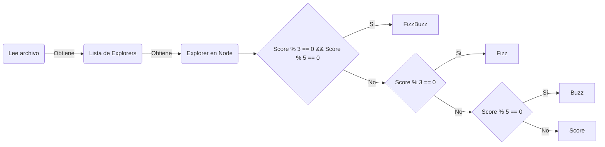
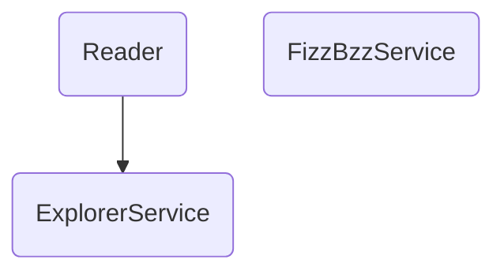
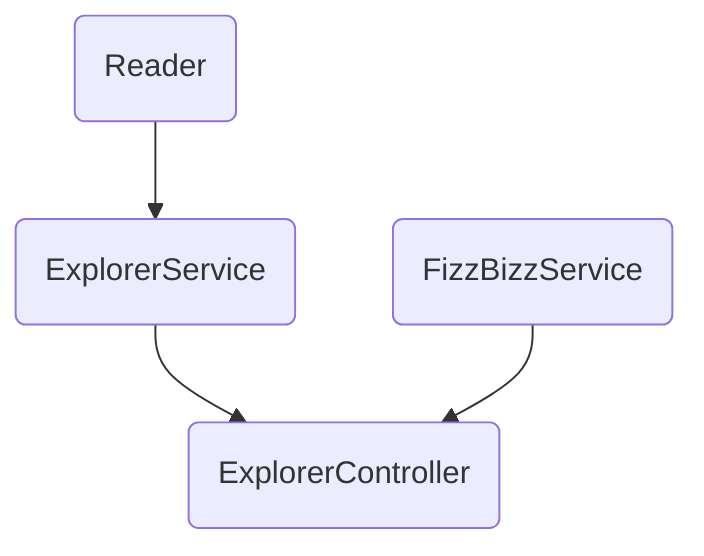
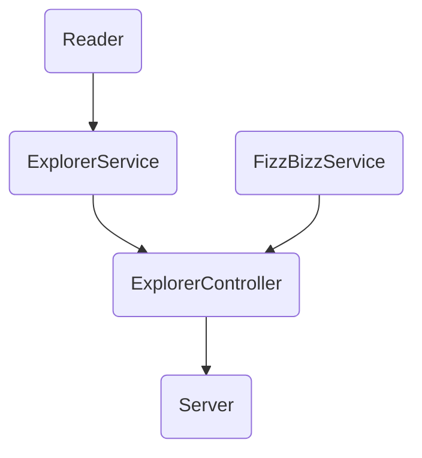

# BizzBuzz

Práctica de refactoring

```mermaid

flowchart LR

A(Lee archivo) -->|Obtiene| B(Lista de Explorers)
B --> |Obtiene| C(Explorer en Node)
C --> D{ Score % 3 == 0 && Score % 5 == 0}
D -->|Si| E[FizzBuzz]
D -->|No| F{Score % 3 == 0}
F -->|Si| G[Fizz]
F -->|No| H{ Score % 5 == 0 }
H -->|Si| I[Buzz]
H -->|No| J[Score]

```

``` mermaid
    flowchart 
    A(Reader) --> B(ExplorerService)
    C(FizzBzzService)
```

## API con express

``` mermaid
    flowchart 
    A(Reader) --> B(ExplorerService)
    B(ExplorerService) --> D(ExplorerController)
    C(FizzBizzService) --> D(ExplorerController)
```
La separación de clases y directorios sirve para tener una estructura pero también una separación de responsabilidades.

``` mermaid
    flowchart 
    A(Reader) --> B(ExplorerService)
    B(ExplorerService) --> D(ExplorerController)
    C(FizzBizzService) --> D(ExplorerController)
    D(ExplorerController) --> E(Server)
```

