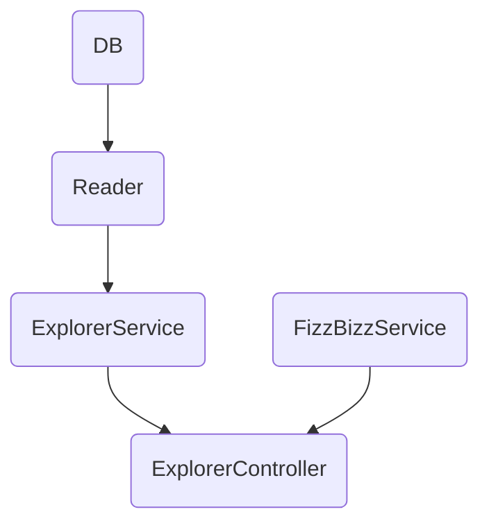
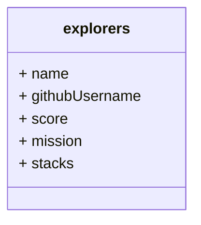
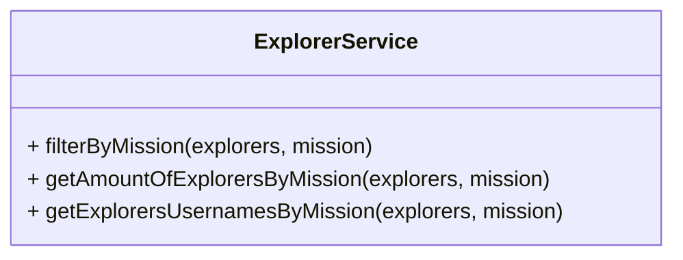
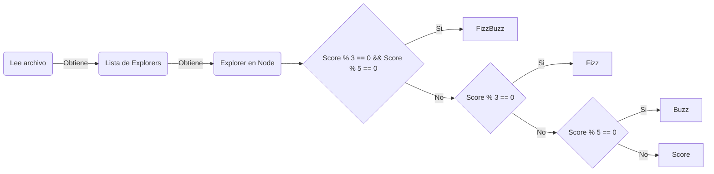
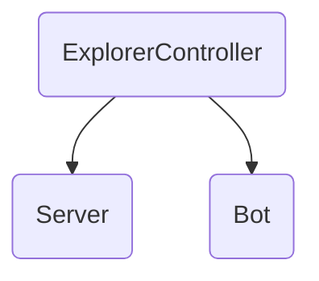

# FIZZBUZZ + Consulta a DB con Chatbot en Telegram By Launch X 🤖

Este repositorio contiene la solución en la que se llevaron una serie de ejercicios para la creación de un proyecto en JavaScript con el uso de dependencias Express, Jets, ESLint hasta llegar a realizar un Chatbot en Telegram.

Proyecto realizado para el curso en Backend con NodeJS en Launch X impartido por [@carlogilmar](https://github.com/carlogilmar).

## Instalación 🛠

Para poder visualizar este proyecto se debe tener previamente instalado `node` y `npm`

## Dependencias 📦

Estas son las dependencias que se utilizaron en este proyecto:

- [Jest](https://jestjs.io/): Esta dependencia nos permite realizar pruebas unitarias (TDD) para comprobar que el código funciona correctamente.
- [ESLint](https://eslint.org/): Esta dependencia nos permite realizar una revisión de nuestro código para verificar que no existan errores.
- [Espress](https://expressjs.com/es/): Esta dependencia nos permite crear un servidor que nos permite realizar las consultas a nuestra API.
- [node-telegram-bot-api](https://github.com/yagop/node-telegram-bot-api): Esta dependencia nos permite crear una conexión con el bot de Telegram.

Para poder ejecutar de manera local `npm install`.

## Solución 📋

Esta práctica consta de 3 partes la primera es el refactoring de un código para realizar una serie de consultas a la DB. La segunda es realizar un refactoring para la validación de las condiciones en FizzBuzz y mostrar la respuesta dependiendo el valor que se esta ingresando. La tercera parte es la coneccion de estas dos soluciones en una clase llamada explorerController la cual da paso para que esta clase sea consumida por el servidor y el bot de Telegram.

Parte del Refactoring de código es separar clases y responsabilidades a travéz de diferentes directorios.



### Parte 1 - Refactoring ExplorerService

Como primera parte se realizó el refactoring de código para realizar 3 consultas a una base de datos la cual contiene registros que estan estructurados de esta manera:



Las consultas se realizan mediante una clase que contiene los siguientes métodos.



#### Parte 2 - Refactoring FizzBuzz

En el refactoring del ejercicio de FizzBuzz se siguio este modelo que describe la validación realizada para resolver el problema:



#### Parte  3

La clase ExplorerController es la encargada de realizar las consultas mediante la conección con la clase ExplorerService y la clase FizzBuzz y enviar la respuesta hacia el servidor o hacia el bot, dependiendo de donde se este consultando.



## Ejecutando las pruebas 🔍

Para ejecutar las pruebas de este proyecto se debe ejecutar el siguiente comando `npm run test`
Parte de la pruebas realizadas con Jest son las siguientes

```javascript
test("Requerimiento 3: Verifica la cantidad de explorers", () =>{
        constNumExplorersInNode=ExplorerService.getAmountOfExplorersByMission(explorers, "node");
        expect(NumExplorersInNode).toBe(10);
    });

    test("Requerimiento 4: Obtener nombres de los explorers en node", () =>{
        constusernamesInNode=  ExplorerService.getExplorersUsernamesByMission(explorers, "node");
        expect(usernamesInNode).toContain("ajolonauta11");
    });
    test("Prueba 7: Asigna FIZZBUZZ cuando recibe el número divicible entre 3 y 5",()=>{
        const scoreVal = 15;
        const resp = FizzbuzzService.applyValidationInNumber(scoreVal);
        expect(resp).toBe("FIZZBUZZ");
    });
```

## EndPoints en express 📌

Para acceder y ver los endpoints se se debe de ejecutar el comando `npm run service` para poder realizar la consulta al servidor y ver los resultados desde el navegador o desde Postman.

|Método HTTP | Endpoint | Descripción |
|---| --- | --- |
| [GET] | /v1/explorers/:mission | Lista de Explorers por misión.  |
| [GET] | /v1/explorers/amount/:mission | Cantidad de Explorers por misión |
| [GET] | /v1/explorers/usernames/:mission | Lista de usernames de Explorers por misión. |
| [GET] | /v1/fizzbuzz/:score| Muestra la respuesta que cumplen con la condición de FizzBuzz. |

## Prueba de endpoits en Postman 👩‍🚀

## Bot de Telegram 🤖


